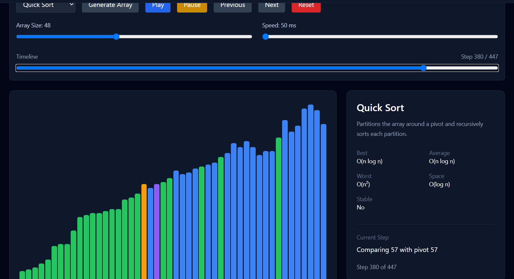
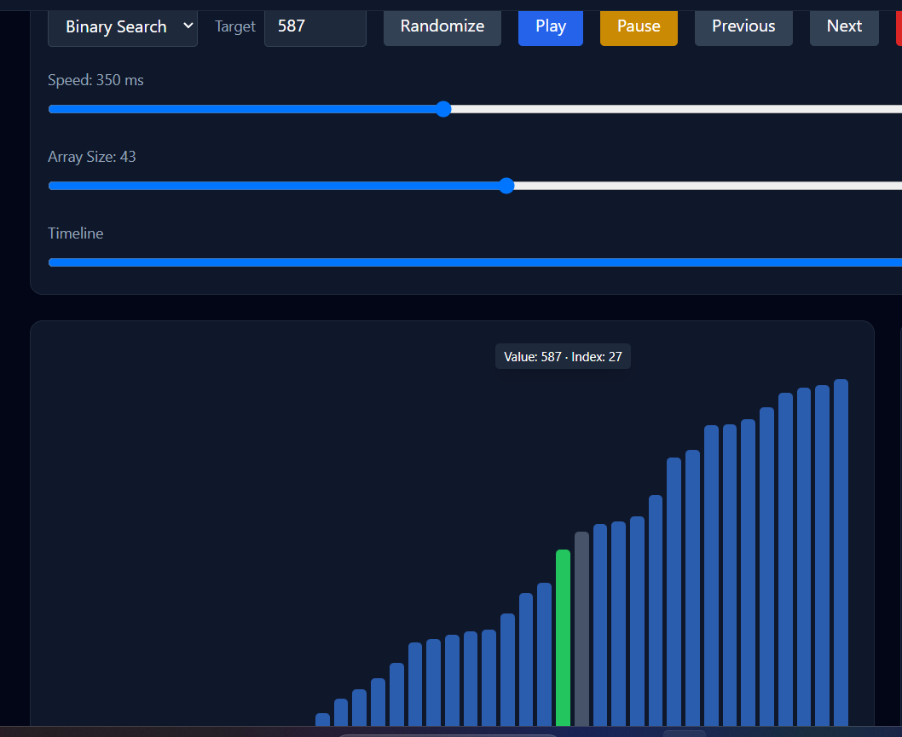
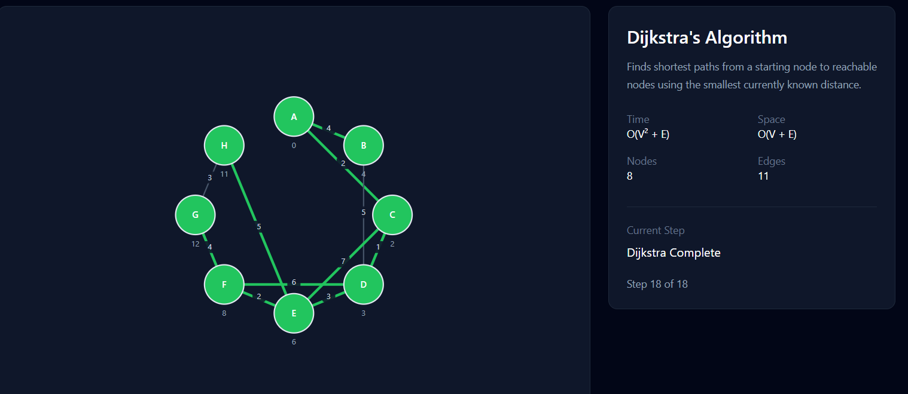

# Algorithm Visualizer

An interactive web application for visualizing and understanding fundamental sorting, searching, and graph algorithms step by step.

The project is designed to make algorithm behavior easier to understand by showing each operation visually while allowing the user to control playback.

## Features

### Sorting Algorithms

- Bubble Sort
- Selection Sort
- Insertion Sort
- Merge Sort
- Quick Sort
- Heap Sort

Sorting visualization includes:

- Random array generation
- Variable array size
- Adjustable animation speed
- Step-by-step playback
- Play / Pause controls
- Previous / Next step controls
- Reset
- Algorithm-specific information and complexity

### Searching Algorithms

- Linear Search
- Binary Search

Searching visualization includes:

- Random sorted arrays
- Custom target value
- Adjustable animation speed
- Randomize button
- Step-by-step playback
- Play / Pause controls
- Previous / Next step controls
- Reset
- Algorithm-specific information and complexity

### Graph Algorithms

- Breadth-First Search (BFS)
- Depth-First Search (DFS)
- Dijkstra's Algorithm

Graph visualization includes:

- Manually configurable graphs
- 4–12 nodes
- Manual edge creation and removal
- Weighted edges
- Adjustable starting node
- Radial and rectangular graph layouts
- Drag-and-drop node positioning
- Adjustable animation speed
- Step-by-step playback
- Play / Pause controls
- Previous / Next step controls
- Reset
- Algorithm-specific information and complexity

## Tech Stack

- React
- TypeScript
- Vite
- Tailwind CSS
- React Router
- Lucide React
- Framer Motion


## Screenshots

### Sorting



### Searching



### Graphs


## Algorithms and Complexity

| Algorithm | Time Complexity | Space Complexity |
|---|---|---|
| Bubble Sort | O(n²) | O(1) |
| Selection Sort | O(n²) | O(1) |
| Insertion Sort | O(n²) | O(1) |
| Merge Sort | O(n log n) | O(n) |
| Quick Sort | O(n²) worst case | O(log n) average |
| Heap Sort | O(n log n) | O(1) |
| Linear Search | O(n) | O(1) |
| Binary Search | O(log n) | O(1) |
| BFS | O(V + E) | O(V) |
| DFS | O(V + E) | O(V) |
| Dijkstra | O(V² + E) | O(V + E) |

## Project Structure

```text
src/
├── algorithms/
│   ├── graphs/
│   ├── searching/
│   └── sorting/
├── components/
│   ├── common/
│   ├── controls/
│   ├── graph/
│   ├── layout/
│   ├── searching/
│   └── sorting/
├── context/
├── hooks/
├── pages/
├── types/
└── utils/